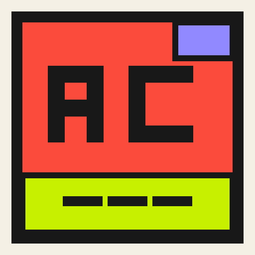

<p align="center">
  
</p>

<h1 align="center">PC Recap</h1>

<p align="center"><strong>Your computer life, played back.</strong></p>

<p align="center">
  A free, open-source visual time capsule for the apps, eras, late nights,<br />
  records, and strange little patterns that made your computer history yours.
</p>

<p align="center">
  <a href="https://pcrecap.online/">Website</a> ·
  <a href="https://github.com/TheAgencyMGE/pc-recap/releases/latest">Download</a> ·
  <a href="docs/INSTALL.md">Install guide</a> ·
  <a href="https://github.com/TheAgencyMGE/pc-recap/issues">Issues</a>
</p>

<p align="center">
  <a href="https://github.com/TheAgencyMGE/pc-recap/releases/latest"></a>
  <a href="https://github.com/TheAgencyMGE/pc-recap/actions/workflows/ci.yml"></a>
  <a href="LICENSE"></a>
  
</p>


## A time capsule, not a timesheet

Most activity trackers focus on productivity. PC Recap is built for remembering. It records real foreground app activity, keeps it in a local SQLite archive, and turns that history into visual daily, weekly, monthly, yearly, and long-term recaps.

There are no productivity grades and no invented demo activity. A new archive begins empty, then grows from sessions PC Recap actually observes or history you explicitly import.

## What PC Recap remembers

- **Your recaps:** Today, Week, Month, Year, All-Time, Decade, On This Day, and a zoomable historical timeline.
- **Your patterns:** favorite apps, categories, pairings, streaks, records, comparisons, late-night habits, and automatically detected eras.
- **Your days:** first and last activity, longest sessions, honest active and idle time, and an interactive Day Replay.
- **Your computer's pulse:** optional CPU, memory, battery, and power context alongside the moments that pushed your system.
- **Your old history:** exact intervals from supported trackers, plus clearly labeled historical clues that never pretend to be measured usage.
- **Your own stories:** custom Recap Studio stories, local Memory Pins, and shareable recap cards.
- **Your archive:** versioned `.pcr` backups, merge previews, daily recovery backups, and storage designed for years of history.

Observations are generated by deterministic rules. PC Recap does not call an AI service or send activity data to one.

## Download PC Recap 1.2

| System | Package | Notes |
| --- | --- | --- |
| Windows 10/11 x64 | [Setup.exe](https://github.com/TheAgencyMGE/pc-recap/releases/download/v1.2.0/PC-Recap-1.2.0-Setup.exe) | Foreground tracking, tray mode, and optional startup launch |
| macOS 12+ Apple Silicon | [DMG](https://github.com/TheAgencyMGE/pc-recap/releases/download/v1.2.0/PC-Recap-1.2.0-mac-arm64.dmg) | For M1, M2, M3, M4, and newer Apple silicon Macs |
| macOS 12+ Intel | [DMG](https://github.com/TheAgencyMGE/pc-recap/releases/download/v1.2.0/PC-Recap-1.2.0-mac-x64.dmg) | For Intel-based Macs |
| Linux x64 | [AppImage](https://github.com/TheAgencyMGE/pc-recap/releases/download/v1.2.0/PC-Recap-1.2.0-linux-x64.AppImage) · [deb](https://github.com/TheAgencyMGE/pc-recap/releases/download/v1.2.0/PC-Recap-1.2.0-linux-x64.deb) | Foreground tracking currently requires X11 and `xprop` |

These beta packages are unsigned, and macOS builds are not notarized. Windows SmartScreen or macOS Gatekeeper may therefore show a warning. Read the [install guide](docs/INSTALL.md) for safe, platform-specific steps and checksum verification.

Wayland does not expose a reliable universal foreground-window API. PC Recap opens on Wayland but reports its foreground collector as unavailable instead of inventing activity.

## Built to be inspectable

- Activity and optional performance history stay on your computer.
- No account, desktop telemetry, cloud sync, advertising identifier, or external AI API.
- No keystrokes, screenshots, clipboard contents, file contents, browser-history scanning, or URL collection.
- Window-title collection is optional and off by default.
- Per-app exclusions, independent performance controls, immediate pause, export, and erase controls are built in.
- The renderer is sandboxed and context-isolated. Node integration is disabled and IPC is explicitly allowlisted.

The product website uses Plausible for aggregate page and download analytics. The desktop app itself remains telemetry-free and never sends computer activity.

Read the [security model](SECURITY.md), [performance notes](docs/PERFORMANCE.md), and [third-party notices](THIRD_PARTY_NOTICES.md).

## Run it locally

PC Recap requires Node.js 22 or newer and npm.

```powershell
npm ci
npm run dev
```

`npm run dev` launches the actual Electron desktop app. It also runs the local React renderer and watches the Electron main and preload processes.

Run the quality suite:

```powershell
npm run test:run
npm run typecheck
npm run smoke:activity
npm run build
npm run smoke:visual
npm run promotion:test
npm run website:validate
```

Build packages on their target operating systems:

```text
npm run package:win
npm run package:mac
npm run package:linux
```

All package commands pass `--publish never`. Publishing is handled only by the tag-driven release workflow after every platform artifact has been built and verified.

## Architecture

```text
Windows / macOS / Linux activity source
                 │
Activity tracker + optional performance sampler
                 │
SQLite raw history + hourly/daily rollups + portable backups
                 │
Analytics + deterministic observation rules
                 │
Allowlisted Electron IPC → React renderer
```

- `src/main` contains Electron lifecycle, tray behavior, platform collectors, SQLite, recovery, backups, and secure IPC.
- `src/shared` contains domain contracts, period math, analytics, and deterministic observations.
- `src/renderer` contains the React UI, timelines, Day Replay, Recap Studio, Memory Pins, and share cards.
- `website` is the dependency-free static product and download site.
- `scripts` contains activity, packaging, release, and website verification tools.

Operating-system-specific tracking stays behind the activity-source boundary. All platforms share the same analytics, persistence, and renderer contracts.

## Contributing

Issues and pull requests are welcome. Start with [CONTRIBUTING.md](CONTRIBUTING.md) and [SUPPORT.md](SUPPORT.md). Features must remain honest with an empty archive, activity must remain on-device, and observations must remain deterministic.

If PC Recap is the kind of open-source project you want to see grow, starring the repository helps more people find it.

## License

Copyright © 2026 Ryan Panda.

The source code is licensed under [GNU GPL v3.0](LICENSE) using the `GPL-3.0-only` SPDX identifier. The license covers the software, not the PC Recap name, logo, or visual identity. Modified distributions should use distinct branding and must not imply endorsement.
